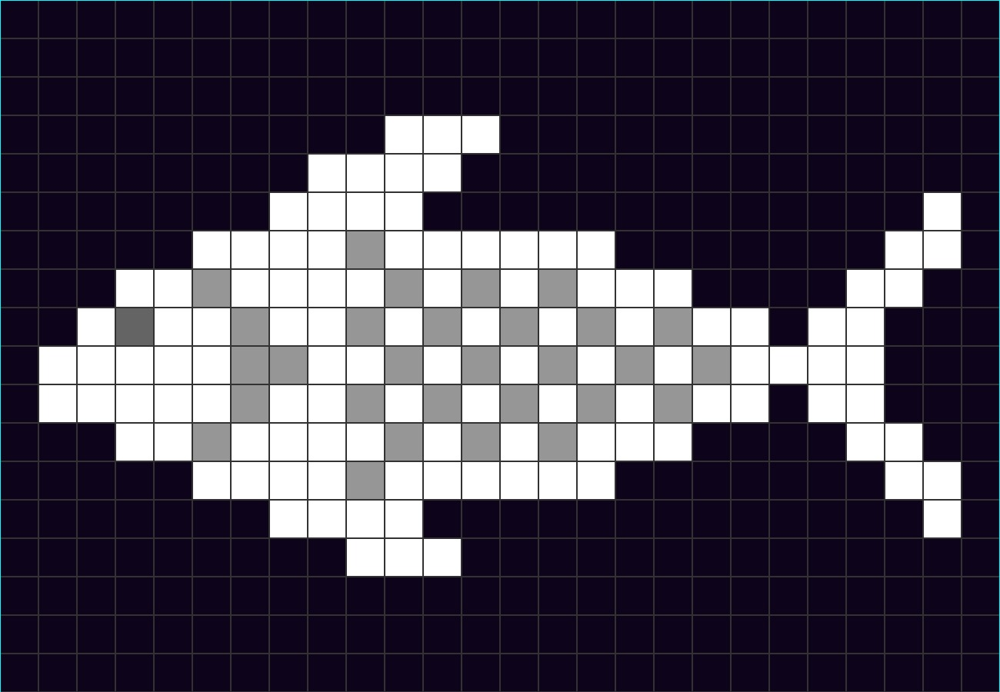
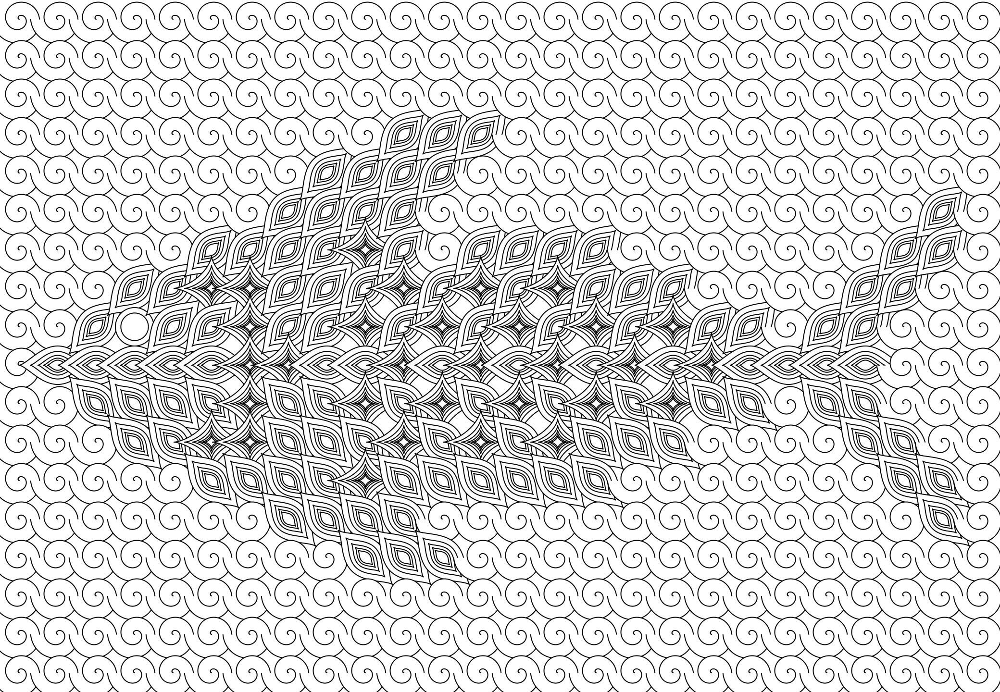

# Zentangles Generator

This code creates a zentangle in p5.js by rendering shape(s) within a grid. Just as a cross-stitch is a grid of colored threads that reveal a pattern, the zentangle reveals a pattern by the choice of shapes within the grid. 

<p align="center"></p>

## Generating Grid Images

I am using low resolution grayscale images -- generally around 40 pixels wide -- to determine which shapes are rendered in each grid location. I have a [JSON dictionary](p5-zentangles-data/data.json) that contains all of the parameters necessary to render the zentangle for each image. For example, for the fish grid, the shapes array contains "astroid", "spiral", "kiss", and "arc."  If you want to learn more about the shape options, I created a [shapes playground](https://kfahn22.github.io/shape_playground/) to experiment with the shapes.

```JSON
 "fish": {
    "img": "assets/fish.png",
    "spacing": 40,
    "shapes": {
      "shape3": {
        "shapeName": "astroid",
        "a": [1.4, 1.4],
        "b": [1.2, 1.2],
        "m": null,
        "n1": null,
        "n2": null,
        "n3": null,
        "n": null,
        "shapeScale": 0.7,
        "shapeAngle": 0,
        "splitX": 0.7,
        "splitY": 0.5,
        "repeat": 6,
        "translate": 0
      },
      "shape1": {
        "shapeName": "spiral",
        "a": 0.8,
        "b": 2,
        "m": 3,
        "n1": 1,
        "n2": 1,
        "n3": 1,
        "n": 1,
        "shapeScale": 0.07,
        "shapeAngle": 0,
        "splitX": 1,
        "splitY": 1,
        "repeat": 1,
        "translate": 0
      },
      "shape2": {
        "shapeName": "arc",
        "a": 2,
        "b": null,
        "m": null,
        "n1": null,
        "n2": null,
        "n3": null,
        "n": 0.5,
        "shapeScale": 0.5,
        "shapeAngle": 0,
        "splitX": 0.7,
        "splitY": 0.5,
        "repeat": 2,
        "translate": 0
      },
      "shape0": {
        "shapeName": "kiss",
        "a": [2, 2],
        "b": [1, 1],
        "m": 0,
        "n1": null,
        "n2": null,
        "n3": null,
        "n": null,
        "shapeScale": 0.5,
        "shapeAngle": -45,
        "splitX": 1,
        "splitY": 0.5,
        "repeat": 5,
        "translate": 0
      }
    }
  }
  ```

  The dictionary contains the link to the grid image, and the shapes associated with each grid location r value. Each of the shape dictionaries contain the necessary shape parameters. The dictionary also contains additional data to control the angle and placement of the shapes within the grid location. In some cases, the zentangle looks best with the different shape rotations depending on the position of the location on the canvas (fish, butterfly). The variables "splitX" and "splitY" determine where the angles change. The variable "repeat" determines how many times the shape is rendered with the the grid location. Lastly, "translate" determines whether the shape is drawn at the center of the grid spot or randomly offset by some small delta.

 The dataArray function receives the image and the array of shapes (with shape data) associated with the image. Depending on the r value of a square in the grid, the corresponding shape is added to the dataArray for a given [i,j] location in the grid. For example, if r value of the the square was 0, the assigned shape might be the kiss curve.  While it would be possible to expand beyond 4 colors, for simplicity sake that is all I am using.

```JavaScript
function dataArray(img, shapes) {
  let data = [];
  img.loadPixels();
  for (let i = 0; i < img.width; i++) {
    data[i] = [];
    for (let j = 0; j < img.height; j++) {
      let index = (i + j * img.width) * 4;
      let r = img.pixels[index + 0];
      if (r >= 200) {
        data[i][j] = {
          shape: shapes.shape0,
        };
      } else if (r < 50) {
        data[i][j] = {
          shape: shapes.shape1,
        };
      } else if (r >= 50 && r < 140) {
        data[i][j] = {
          shape: shapes.shape2,
        };
       } else if (r >= 140 && r < 200) {
        data[i][j] = {
          shape: shapes.shape3,
        };
      }
    }
  }
  return data;
}
```

<p align="center"></p>

## Creating the grid images

 The images are created using several different methods. The wave function collapse model uses simple grid images, which was the genesis of my idea to adapt them  to control sketch parameters.
 
 I started with free cross stitch patterns, and then adapted the ones that I thought would be best suited to my use-case in [Piskel](https://www.piskelapp.com/). I stuck to simple designs, such as flowers and animals.

 I also uploaded some of my photos to Piskel and used as the basis to ceate some grid images. I am not sure that this method was entirely successful since it is probably hard to identify the source image, but I still think it generates a nice pattern. For example, I edited a picture of a slot canyon, and here is the zentangle.

 <p align="center"></p>

## Resources

- [p5 sketch to view grid images](https://editor.p5js.org/codingtrain/sketches/_7Pa8986g)

- [Wave Function Collapse images](https://github.com/CodingTrain/Wave-Function-Collapse/tree/main/p5js/overlapping-model/images)

- [CraftDesignOnline](https://craftdesignonline.com/pattern-grid/)

- [Sunflower cross stitch pattern](https://www.lovecrafts.com/en-us/p/sunflower-in-dmc-pat0883-downloadable-pdf)

- [Piskel tutorial](https://github.com/kfahn22/Wave-Function-Collapse/wiki/Creating-a-source-image-for-the-WFC-%E2%80%90-overlapping-model)
